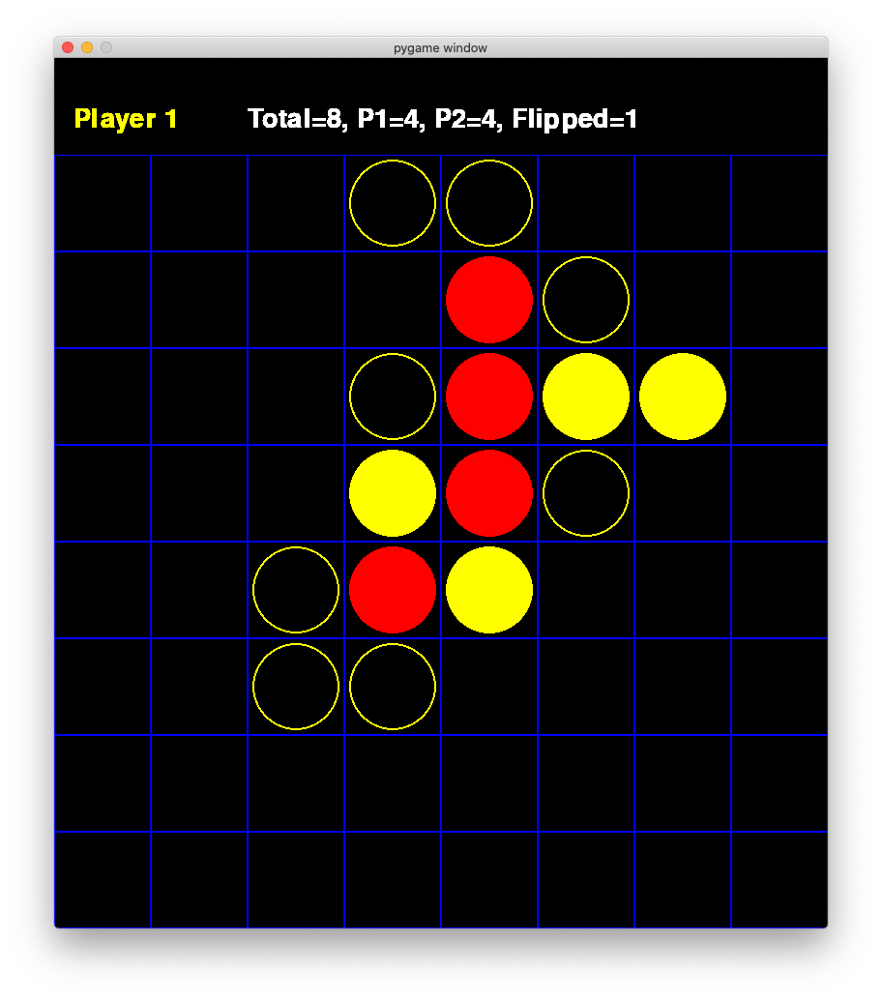

Reversal

I was watching a tutorial on creating connect4 on python recently, and I wondered whether I could do the same for reversal, one of my favourite board games. So that's what I did!

# Functions

The functions are being iteratively updated throughout the development of the game. Hence, the descriptions below only reflect the newest version of theprogram.

Here's the list of functions for this reversal game:

1. `create_board()`  
Initialises an empty board (a numpy array) with 4 pieces in the centre.

2. `can_play(board, piece)`  
Determines whether or not the user can place a piece, by performing `is_reversible()` on all vacant spots on the board. (In some cases a player may be inhibited to do so since there is no available spot where a reversal can occur.)

3. `is_vacant(board, row, col, piece)`  
Determines whether a position on a board is empty.

4. `is_reversible(board, row, col, piece)`  
Determines whether or not placing a piece at the given location would lead to reversals.

5. `drop_piece(board, row, col, piece)`  
Performed after `is_reversible()`. The piece is placed at the specified location and performs all reversals required. Also returns an integer, which is the number of reversals.

6. `print_board(board, flip_num)`  
Prints the board (both actual terminal output and a 'heat map' for better visibility), the total number of pieces on the board, the number of pieces for each player, and the number of flips (reversals) performed.

7. `def is_end_game(board)`  
Boolean true if all entries on the board are non-zero (so basically the board is full).

8. `def insert(row, col, piece)`  
A function specifically designed for the jupyter workbook, which performs `drop_piece()` and `print_board()`. Note that the notebook does not actually perform verification steps such as `can_play()`, `is_vacant()`, `is_reversible()`.

# Quick Start

For a quick look on how to play with the command line version, have a look at the [jupyter notebook](reversal_test.ipynb) or a [pdf version of the jupyter notebook](reversal_test.pdf).

The actual game is programmed in [reversal.py](reversal.py). To run the command line version, type the following in your terminal:

    python3 ./reversal.py

The GUI version of the game is programmed in [reversal_gui_mac.py](reversal_gui_mac.py). To run the GUI version, run:

     python3 ./reversal_gui_mac.py

Here's a quick screenshot of the game.

 

As you can see, the interface displays the locations available for the player as well.

In addition, special messages are displayed when appropriate. The special messages available are:

- "Error. Position not valid. Player {turn} go again."
- "Can't Move! Player {turn} cannot move. It is player {next_turn}'s turn."
- "Player {turn} wins!"

## Packages required

| Package \ Game version | [reversal.py (Command line version)](reversal.py) | [Jupyter Notebook](reversal_test.ipynb) | [reversal_gui_mac.py (GUI Version)](reversal_gui_mac.py) |
|---------|-----------|---------|------------|
| `numpy`                | Y   | Y    | Y         |
| `matplotlib`           | Y     | Y     | Y            |
| `pygame`               |   |         | Y            |

This assumes that you have python3 installed (as well as jupyter notebook installed if you would like to run the notebook).

# Plans for the future

- To create a more beautiful graphical user interface for this game.
- Create an AI to play with me......? Perhaps a bit too far fetched for me right now, but gonna look into it. Maybe I can utilise deep learning (wow) or perhaps the relatively straightforward minimax algorithm.